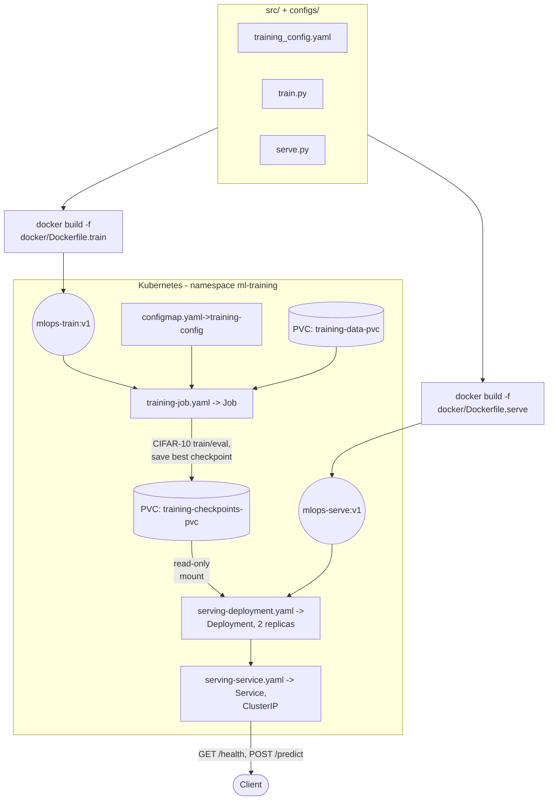

# mlops-pytorch-pipeline

---

#### This is an academic assignment-3 from MLOps course in Web Enabled M-Tech course. It is implemented and maintained by Chintapalli Dharmendra (DA25M559).

---

### Architecture

CIFAR-10 images flow through the same `src/` code in two contexts: trained locally or in a Kubernetes `Job`, then served locally or from a Kubernetes `Deployment`. Both paths are packaged as Docker images from the same source tree.



- Locally, `train.py` writes its best checkpoint straight to `checkpoints/` and `serve.py` reads it from there (see the Setup and Docker sections below).
- In the cluster, the same handoff happens through the `training-checkpoints-pvc` volume instead of a local directory.

### Project Structure

```Shell
mlops-pytorch-pipeline/
··· README.md
··· .gitignore
··· .github/
· ··· workflows/
· ··· ci.yml
··· src/
· ··· train.py
· ··· model.py
· ··· dataset.py
· ··· serve.py
··· configs/
· ··· training_config.yaml

··· docker/
· ··· Dockerfile.train
· ··· Dockerfile.serve
··· k8s/
· ··· namespace.yaml
· ··· training-job.yaml
· ··· serving-deployment.yaml
· ··· serving-service.yaml
· ··· configmap.yaml
· ··· hpa.yaml
··· requirements/
· ··· train.txt
· ··· serve.txt
··· tests/
··· test_model.py
```

### Setup

**Prerequisites**: Python 3.11 (matches the `python:3.11-slim-bookworm` base image), Docker, and outbound internet access on the first run (downloads CIFAR-10 and pretrained ResNet18 weights). `kubectl` against a cluster is only needed for the Kubernetes section below.

**1. Clone and install dependencies**

```bash
git clone https://github.com/Chintapallidharmendra/mlops-pytorch-pipeline.git
cd mlops-pytorch-pipeline
python3.11 -m venv .venv
source .venv/bin/activate
pip install -r requirements/train.txt   # training + local experimentation
# or: pip install -r requirements/serve.txt   # inference only
```

**2. Train locally (no Docker)**

Run from the repository root so the default config path (`configs/training_config.yaml`) resolves correctly:

```bash
python src/train.py
```

`data/` and `checkpoints/` are gitignored and created on first run; training progress logs as JSON lines per epoch, and the best checkpoint (by validation loss) lands at `checkpoints/classifier_v1.pt`.

**3. Serve locally (no Docker)**

```bash
pip install -r requirements/serve.txt
uvicorn serve:app --app-dir src --host 0.0.0.0 --port 8080
```

Run this from the repository root too — `serve.py` resolves `MODEL_CHECKPOINT_PATH` (default `checkpoints/classifier_v1.pt`) relative to the current directory, and `--app-dir src` puts `src/` on `sys.path` so `serve.py`'s sibling imports (`dataset`, `model`) resolve.

```bash
curl -X POST http://localhost:8080/predict -F "file=@test_image.png"
```

**4. Tests**

```bash
pip install pytest
pytest tests/
```

`tests/test_model.py` is currently an empty scaffold reserved for model/unit tests.

### Training Image

Multi-stage image (`docker/Dockerfile.train`) that trains the CIFAR-10 classifier. Stage 1 (`base`) installs the pinned dependencies from `requirements/train.txt` (`torch==2.5.1`, `torchvision==0.20.1`, `pyyaml==6.0.2`); stage 2 (`training`) copies in `src/` and `configs/` and runs `src/train.py`.

Build:

```bash
docker build -f docker/Dockerfile.train -t mlops-train:v1 .
```

Run:

```bash
docker run --rm \
  -v $(pwd)/data:/app/data \
  -v $(pwd)/checkpoints:/app/checkpoints \
  mlops-train:v1
```

- `configs/training_config.yaml` is baked into the image as the default config; mount your own over it with `-v $(pwd)/configs:/app/configs` to override it at runtime.
- Training progress is logged as JSON lines to stdout per epoch; the best checkpoint (by validation loss) is written to `/app/checkpoints`.
- The first run needs outbound internet access to download the CIFAR-10 dataset and pretrained ResNet18 weights.

### Serving Image

Two-stage image (`docker/Dockerfile.serve`) that serves the trained classifier over a FastAPI app (`src/serve.py`). Stage 1 (`base`) installs the pinned inference-only dependencies from `requirements/serve.txt` (`torch==2.5.1`, `torchvision==0.20.1`, `fastapi==0.115.6`, `uvicorn[standard]==0.34.0`, `python-multipart==0.0.20`, `pillow==11.1.0`); stage 2 (`serving`) copies in `src/`, creates a non-root user, and runs `uvicorn` against `serve:app` on port 8080.

Build:

```bash
docker build -f docker/Dockerfile.serve -t mlops-serve:v1 .
```

Run:

```bash
docker run --rm -p 8080:8080 \
  -v $(pwd)/checkpoints:/app/checkpoints \
  mlops-serve:v1
```

- The checkpoint is mounted at runtime, not baked into the image — same pattern as the training image. `serve.py` defaults to `checkpoints/classifier_v1.pt`, overridable via the `MODEL_CHECKPOINT_PATH` env var.
- `GET /health` reports `{"status": "ok"}` once the model has loaded; the image's `HEALTHCHECK` polls this endpoint.
- `POST /predict` takes a multipart file upload under the field name `file` (not `image`) and returns the predicted CIFAR-10 class with per-class probabilities:

```bash
curl -X POST http://localhost:8080/predict -F "file=@test_image.png"
```

- The container runs as a non-root user (`appuser`, uid 1000).

### Kubernetes Deployment

The `k8s/` manifests deploy the pipeline into a namespace called `ml-training`: a `Job` trains to completion and writes a checkpoint to a `PersistentVolumeClaim`, and a `Deployment` serves that checkpoint behind a `ClusterIP` `Service` (see the architecture diagram above).

Build the images and make them available to the cluster (load directly for a local cluster like `kind`/`minikube`; for a remote cluster, push to a registry and update the `image:` fields in `k8s/training-job.yaml` and `k8s/serving-deployment.yaml`):

```bash
docker build -f docker/Dockerfile.train -t mlops-train:v1 .
docker build -f docker/Dockerfile.serve -t mlops-serve:v1 .

# kind:     kind load docker-image mlops-train:v1 mlops-serve:v1
# minikube: minikube image load mlops-train:v1 && minikube image load mlops-serve:v1
```

The manifests reference two `PersistentVolumeClaim`s — `training-data-pvc` and `training-checkpoints-pvc` — that aren't included in `k8s/`; provision them first with a `StorageClass` suited to your cluster, e.g.:

```yaml
apiVersion: v1
kind: PersistentVolumeClaim
metadata:
  name: training-data-pvc
  namespace: ml-training
spec:
  accessModes: ["ReadWriteOnce"]
  resources:
    requests:
      storage: 2Gi
---
apiVersion: v1
kind: PersistentVolumeClaim
metadata:
  name: training-checkpoints-pvc
  namespace: ml-training
spec:
  accessModes: ["ReadWriteOnce"]
  resources:
    requests:
      storage: 1Gi
```

Then apply the manifests, waiting for the training `Job` to finish before starting the serving `Deployment`:

```bash
kubectl apply -f k8s/namespace.yaml
kubectl apply -f k8s/configmap.yaml
kubectl apply -f <your-pvcs>.yaml
kubectl apply -f k8s/training-job.yaml
kubectl wait --for=condition=complete job/training-job -n ml-training --timeout=600s

kubectl apply -f k8s/serving-deployment.yaml
kubectl apply -f k8s/serving-service.yaml
```

Check status and logs:

```bash
kubectl get jobs,pods,deployments,svc -n ml-training
kubectl logs -n ml-training job/training-job -f
```

Reach the service from inside the cluster at `http://serving.ml-training.svc.cluster.local`, or port-forward it locally:

```bash
kubectl port-forward -n ml-training svc/serving 8080:80
curl -X POST http://localhost:8080/predict -F "file=@test_image.png"
```

- `k8s/hpa.yaml` is currently an empty placeholder for horizontal pod autoscaling and isn't applied by these steps.

---


Please feel free to reach out to [Chintapalli Dharmendra](mailto:da25m559@smail.iitm.ac.in) for any clarifications, queries and suggestions.